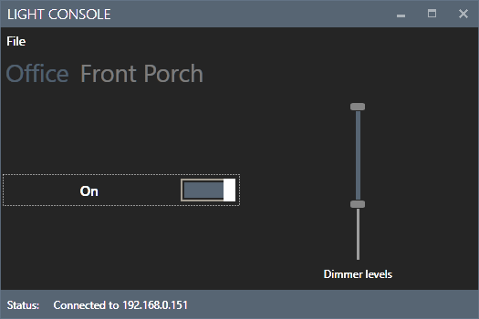

# lightconsole
A Windows desktop control app for controlling TCP Connected lights. I prefer having desktop app over a
web app which is why I wrote this.

This is more or less a port of the nodejs library from https://github.com/stockmopar/connectedbytcp

